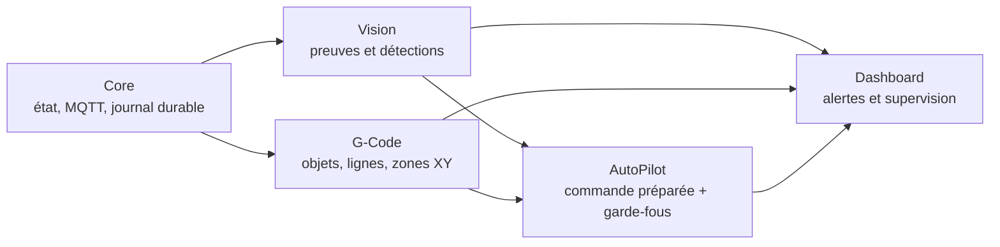

# Architecture V3 — supervision sûre d’impression

V3 est composée de cinq briques séparées, communiquant uniquement par des
structures de données locales et persistées. Aucune brique Vision, G-Code ou
Dashboard n’envoie directement une commande à l’imprimante.

## Core

- suit l’imprimante localement via MQTT TLS épinglé ;
- enregistre les rapports d’impression importants dans `events.sqlite3` avant
  leur traitement ;
- conserve l’inventaire, les déductions idempotentes et les captures sans les
  exposer au réseau ;
- n’accorde aucun privilège de commande à ses sous-modules.

## Vision — V2.1

Les détecteurs doivent soumettre des observations normalisées : type de défaut,
confiance, empreinte de l’image, objet ciblé et source. Le Gardien exige
plusieurs images distinctes avant de créer une alerte. Les catégories prévues
sont `spaghetti`, `detachment`, `warping` et `extrusion_anomaly`.

Un modèle local peut être ajouté comme adaptateur, mais son résultat reste une
observation : il ne peut jamais déclencher une commande par lui-même.

## G-Code — V2.2

`gcode_mapper.py` extrait uniquement les objets déclarés explicitement par le
G-code (balises `OBJECT`/`PRINTING_OBJECT` et fin d’objet). Chaque objet porte
sa plage de lignes et son enveloppe XY. Sans balise fiable, l’état reste
`unavailable` : aucune association inventée n’est autorisée.

## AutoPilot — V2.3 et V3.0

AutoPilot élabore une exclusion unitaire préparée et vérifie que l’objet est
connu de la cartographie et de `slice_info.config`. La commande est journalisée
dans SQLite, de façon idempotente, mais son état reste
`prepared_command_only` : aucun transport n’est invoqué. Le passage à une
action physique exige simultanément :

1. une commande Bambu documentée pour le modèle et firmware visés ;
2. une exécution idempotente vérifiée sur plateau de test ;
3. une réponse machine qui prouve l’exclusion du seul objet demandé ;
4. un journal de commande persistant et une validation utilisateur de la
   politique d’automatisation.

Tant qu’un de ces critères manque, V3 reste en observation et alerte humaine.

## Dashboard et rapports — V2.4/V2.5

Le tableau de bord agrège l’état MQTT, la cartographie, les alertes Vision,
les plans AutoPilot, l’espace de stockage Vision et le journal durable. Les
rapports doivent rester exportables localement et ne jamais inclure code LAN,
jetons ou données non nécessaires.
